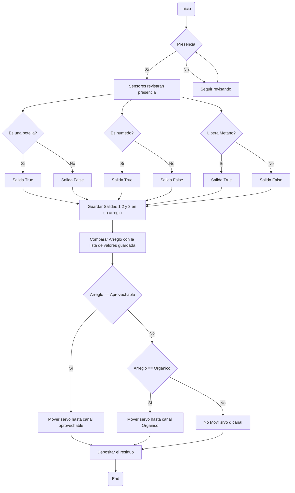

# ProyectoElectronica
## Diagrama de flujo


## Servomotores

### Programa actual
```ino
#include <Servo.h>  // Incluimos la librería para controlar el servo

Servo miServo;  // Creamos un objeto de tipo Servo
Servo otroServo;

int boton1Pin = 2;  // Pin para el primer pulsador
int boton2Pin = 3;  // Pin para el segundo pulsador
int boton3Pin = 4;
int estadoBoton1 = 0;  // Variable para leer el estado del primer pulsador
int estadoBoton2 = 0;  // Variable para leer el estado del segundo pulsador
int estadoBoton3 = 0;

void setup() {
  pinMode(boton1Pin, INPUT_PULLUP);  // Configuramos el primer botón con resistencia pull-up interna
  pinMode(boton2Pin, INPUT_PULLUP);  // Configuramos el segundo botón con resistencia pull-up interna
  pinMode(boton3Pin, INPUT_PULLUP);
  
  miServo.attach(10);  // Conectamos el servo al pin 10
  otroServo.attach(9); 
  Serial.begin(9600);  // Iniciamos la comunicación serial para depuración
}

void loop() {
  estadoBoton1 = digitalRead(boton1Pin);  // Leemos el estado del primer pulsador
  estadoBoton2 = digitalRead(boton2Pin);  // Leemos el estado del segundo pulsador
  estadoBoton3 = digitalRead(boton3Pin);

  if (estadoBoton1 == LOW) {  // Si el primer botón está presionado (estado bajo)
    Serial.println("Botón 1 presionado");
    miServo.write(90);  // Coloca el servo en la posición 0 grados
    delay(200);
    otroServo.write(90);
    delay(500);  // Esperamos para evitar lecturas erróneas rápidas
  } 
  else if (estadoBoton2 == LOW) {  // Si el segundo botón está presionado (estado bajo)
    Serial.println("Botón 2 presionado");
    miServo.write(135);  // Coloca el servo en la posición 90 grados
    delay(200);
    otroServo.write(90);
    delay(500);  // Esperamos para evitar lecturas erróneas rápidas
  }
  else if (estadoBoton3 == LOW) {
    Serial.println("Botón 3 presionado");
    otroServo.write(90);
    delay(500);
  }
  else {
    Serial.println("Ningún botón presionado");
    miServo.write(45);  // Coloca el servo en la posición 180 grados por defecto
    otroServo.write(0);
    delay(500);
  }
}
```
